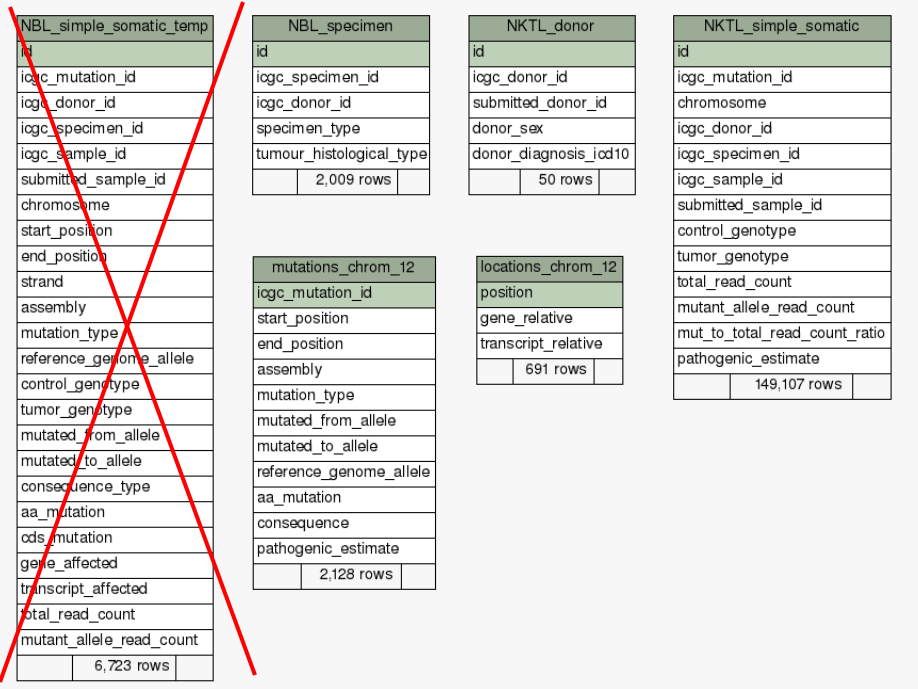

# CG

_(writeup in progress)_

CG is a set of scripts for extracting information about somatic 
mutations from 
[TCGA](https://portal.gdc.cancer.gov/)
and 
[ICGC](https://dcc.icgc.org/)
databases. The ICGC branch also contains tools necessary to
merge the info from the two sources. The scripts add up to a loosely connected pipeline 
(or, rather, two pipelines).  They re-organize the data and store it in the local MySQL 
database.  While the  back end of each pipeline is rather generic, the front end is
geared toward answering particular questions for which they were originally written.

CG is not an out-of-the box solution. Rather, it is a starter kit, in case you would like to
do some cancer genomics data analysis on your own. Installing CG database(s) may take a
day or two if you are willing to go with the pipeline as-is. With tweaks, a week is 
not an unreasonable time estimate.

Why bother with the local copy of the data? I do not know a general answer to that question.
You should check the homepage  of both databases - maybe the information you
 are looking for is already  available.
Here the original motive was to study the co-occurrence of mutations in different genes. 
These types of questions are not readily answerable using data portals - portals  tend to
agglomerate data on per-gene basis, in order to protect the privacy of sample donors. 

<!-- this is a comment -->
<!-- making TOC: https://github.com/ekalinin/github-markdown-toc -->
<!-- once installed, use with gh-md-toc README.md    -->
## Table of Contents
* [Dependencies](#dependencies)
* [TCGA](#tcga)
* [ICGC](#icgc)
     * [Config file](#config-file)
     * [ICGC data download](#icgc-data-download)
     * [Getting and storing some auxilliary data](#getting-and-storing-some-auxilliary-data)
     * [Measuring the field lengths and making MySQL tables](#measuring-the-field-lengths-and-making-mysql-tables)
     * [Filling and  indexing database tables](#filling-and--indexing-database-tables)
     * [Reorganizing mutation data](#reorganizing-mutation-data)
     * [Removing duplicates](#removing-duplicates)
     * [Adding reliability info](#adding-reliability-info)
     * [Merging with TCGA](#merging-with-tcga)
     * [Some generic stats](#some-generic-stats)
     * [Project-specific stats](#project-specific-stats)
 
 
 
 ## Dependencies
 In addition to TCGA and ICGC themselves, CG relies on
 * MySQL
 * MySQLdb python module, installed with _sudo apt install python3-mysqldb_
 * gene symbols from HUGO gene nomenclature committee (see [here](https://www.genenames.org/download/custom/))
 * Annovar for location and functional annotation
 * Optional: [line-profiler](https://github.com/rkern/line_profiler#line-profiler) for python
 
 ## TCGA
 The ecga branch of the pipeline got obsoleted before coming to production stage. 
 It contains various blind a alleys and wrong turns. Its current use is as a prep
 step for merging with ICGC. The only two subdirs there that ever reached a production stage are 
 [00_common_tasks](tcga/00_common_tasks) and [01_somatic_mutations](tcga/01_somatic_mutations).
 
 ## Common tasks
 
 'Common tasks' refer to tasks needed to make a functional local subset of TCGA. The only
 non-obsolete piece remaining is [200_find_maf_files_in_GDC.py](tcga/00_common_tasks/200_find_maf_files_in_GDC.py) 
 that can be used to download somatic mutation tables from GDC - a repository of legacy TCGA data.
 
 ## Compiling somatic mutations
 
 
 ### Creating MySQL tables
 [001_drop_maf_tables]() though [002_create_maf_tables](cga/01_somatic_mutations/002_create_maf_tables.py) 
 
 ### Reading in and cleaning up the data
 [003_maf_meta](cga/01_somatic_mutations/003_maf_meta.py) through [012_drop_annotation](tcga/01_somatic_mutations/012_drop_annotation_in_remaining_conflicted.py) 
 
 
 ### 'Stuttering' samples
 
 SOme samples in TCGA have more
 [014_drop_stuttering_samples.py](tcga/01_somatic_mutations/014_drop_stuttering_samples.py) 
 
 After this point  we can move to ICGC - TCGA data will be fused into the combined dataset over there.
 
 ### Some basic stats
 ... provided by [020_db_stats.py](tcga/01_somatic_mutations/020_db_stats.py) 
 through [027_patient_freqs.py](tcga/01_somatic_mutations/027_patient_freqs.py).
 
 
 

 
 
 
 ## ICGC
 
 ### config file
 You can set some recurring constants - such as data directories or mysql conf file(s) - 
 in the [config.py](icgc/config.py) file.
 
 ### ICGC data download
 
 Just like the tcga branch, this branch of the pipeline starts by downloading the data from
 the source, ICGC in this case. Note however that here you will need the access token. 
 Obtaining one is a lengthy process (as in several weeks to several months) which you can
 start investigating [here](https://icgc.org/daco).
 
 One you have the access token place it in the environmental variable called ICGC_TOKEN, to make
 the download scripts work.
 
 Note in particular that we are grouping some cancers under the same head-group. 
 See [06_group_cancers.py](icgc/00_data_download/06_group_cancers.py). This is because different depositors may
 use different shorthands for the same cancer (e.g. LICA == 'Liver Cancer', 
 LINC == 'Liver Cancer - NCC', LIRI == 'Liver Cancer - RIKEN'), though in some cases it 
 might not be clear which cancer the depositors refer to. Feel free to change in you version of the code
 the grouping defined in [06_group_cancers.py](icgc/00_data_download/06_group_cancers.py), or to skip it altogether.
 
 ### Getting and storing some auxilliary data
 
 In [01_hgnc_name_resolution_table.py](icgc/01_hgnc_name_resolution_table.py) and 
 [02_ensembl_id_table.py](icgc/02_ensembl_id_table.py) we make and fill some tables we will use later for name resolution 
 (translating between gene and protein names used in different contexts). Make sure you have 
 the mysql conf file  and set its path in these two scripts, or arrange some other way to
 access the local database. The last I checked, python's MySQLdb package did not work with
 the encripted cnf files, so the only alternative is using 
 [client field in generic mysql option file](https://dev.mysql.com/doc/refman/8.0/en/option-files.html),
 like this:
 
`[client]`   
`user = blah`  
`host = localhost`  
`password = "somepasswd"`

In MySQL shell (or however you talk to your MySQL server) create the database icgc and the user _blah_, 
and give _blah_  the permissions to write to and read from _icgc_:

`create database icgc;`    
`create user 'blah'@'localhost' identified by 'somepasswd';`  
`grant all privileges on icgc.* to 'blah'@'localhost';`  
`flush privileges;`  

 
The canonical transcript id is not readily available from Ensembl Mart, thus for our purposes
here you can find this info in the table called ensembl_gene2trans_stable.tsv.bz2 in the
[hacks](icgc/hacks) directory. Put it someplace where
[02_ensembl_id.py](icgc/02_ensembl_id.py) can find it.

### Measuring the field lengths and making MySQL tables

[03_find_max_field_length.py](icgc/03_find_max_field_length.py) and 
[04_make_tables.py](icgc/04_make_tables.py): 
Make sure that the fields in the mysql tables are big enough for each entry and create mysql tables.

### Filling and  indexing database tables
[05_write_mutations_tsv.py](icgc05_write_mutations_tsv.py) through [08_make_indices.py](icgc/08_make_indices_on_temp_tables.py).
For large tables, rather than loading them through python, 
it turns out to be faster to create tsvs and 
then load them from mysql shell (as in [07_load_mysql.py](icgc/07_load_mysql.py); alternative: use mysqlimport manually) 
 to read them in wholesale. These scripts take care of that part , plus some index creating on the newly loaded tables.
 Make sure to run [08_make_indices.py](icgc/08_make_indices_on_temp_tables.py) - [12_reorganize_mutations.py](icgc/12_reorganize_variants.py)
 pretty much does not work without it at all. All index making is slow here - run overnight. This is probably the weakest (as in the-least-likely-to-scale) 
part of the whole pipeline, but is unclear
whether it is worth the optimization effort.

### Reorganizing mutation data
This is where we depart from ICGC original database architecture - which is pretty much
nonexistent and consists of massive duplication of annotation for each occurrence of a mutation
and for each of its interpretations within various transcripts.

So instead we reorganize the database into something like this 

where *_specimen, \*\_donor, and \*\_simple_somatic tables exist for each cancer type, and mutations\_\* 
and locations\_\* tables exist for each chromosome.

<!-- to produce the schema visualization
java -jar ~/Downloads/schemaSpy_5.0.0.jar  -t mysql -host localhost  -db icgc  \
-u usrnm -p passwd -o icgc_schema  
-dp ~/Downloads/mysql-connector-java-5.1.6/mysql-connector-java-5.1.6-bin.jar 
where  icgc_schema is output dir
schemaSPy: http://schemaspy.sourceforge.net/
mysql-connector-java:  https://dev.mysql.com/downloads/connector/j/5.1.html
-->

It looks like ICGC is systematic in that ic uses GRCh37 assmebly in all entries. 
The check can be found in [09_assembly_check.py](icgc/09_assembly_check.py)

New tables are created in [10_check_mut_tables_and_make_new_ones.py](icgc/10_check_mut_tables_and_make_new_ones.py),
while in [11_consequence_vocab.py](icgc/11_consequence_vocab.py)
 we inspect the 'consequence' vocabulary employed by ICGC. There seems to
some confusion there about the location vs. the consequence of a mutation.

Note that in [12_reorganize_mutations.py](icgc/12_reorganize_variants.py) you can choose to
run in parallel (the number of 'chunks' in main()). 
The companion pieces 
  [13_reorganize_mutations.py](icgc/13_reorganize_mutations.py) and
   [14_reorganize_locations.py](icgc/14_reorganize_locations.py) are a a bit faster.
   This script uses ANnovar to check chromosome addresses / translate them to hg 19
   which in retrospective turned out to be a bit of paranoia - all the addresses
   seem to systematically refer to GRCh37 (which differs from hg19 only in MT contigs 
   which we do not follow anyway).
 (Do not forget to create indices
 using [08_make_indices_on_temp_tables.py](icgc/08_make_indices_on_temp_tables.py)) 
 
 
 ### Removing duplicates
 ICGC is rife with data duplication, coming from various sources. Some seem to be bookkeeping mistakes with the
 same patient data finding its way into the dataset through various depositors; some are the results  of the re-sampling 
 of the same  tumor, while some are completely obscure, with all identifiers being identical everywhere 
 (see [18_cleanup_duplicate_entries.py](icgc/18_cleanup_duplicate_entries.py)).
 
 If [12_reorganize_mutations.py](icgc/12_reorganize_variants.py) is the weakest link in the pipeline, 
 [18_cleanup_duplicate_entries.py](icgc/18_cleanup_duplicate_entries.py) is the most likely to cover-up for a problem, 
possibly originating in ICGC itself. Some mutations  have identical tuple
 of identifiers (icgc_mutation_id, icgc_donor_id, icgc_specimen_id, icgc_sample_id). Note that this
 is after we have reorganized the database so that the mutation and location info sit in 
 different tables from the donor info. Not sure what this is about (the same sample analyzed independently multiple
 times?), but when found, this script chooses the entry with the highest coverage if possible. See the script for the full
 resolution strategy and make sure to run [17_make_jumbo_index](icgc/17_make_jumbo_index_on_simple_somatic_tables.py) 
 because 
 [18_cleanup_duplicate_entries.py](icgc/18_cleanup_duplicate_entries.py) is useless without it.
 
 
 There might be further problems: See for example, mutation MU2003689, which, 
 [so the ICGC page claims](https://dcc.icgc.org/mutations/MU2003689) can be found in two distinct donors. 
 The closer  inspection of the two donors shows however that their submitter ID is the same, as is the age 
 of the 'two' women. (The tumour subtype has different description, reflecting, apparently,  the
 curator's preference.) Indeed, donors table for BRCA, at this point in the pipeline has 
 1976 distinct ICGC donor ids, and 1928 distinct submitter IDs. BRCA does turn out to be the biggest offender here,
 followed by LICA with 8 duplicated donors. It is not clear whether these duplicates refer to the same
 tumor at the same stage because even the submitter sample ids might be different
 (see [19_cleanup_duplicate_donors.py](icgc/19_cleanup_duplicate_donors.py)). 

 Even after this cleanup we are still not done with the duplications problem - we might have the
 same donor with differing specimen and sample ids (apparently, not sure whether ICGC refers to
 biological replicates - i.e. samples taken from different sites  - as specimens, and
 to technical replicates as samples). Perhaps they might have a role when answering different
 types if questions, but here we do not want to have these results mistaken for recurring mutations, 
 thus we remove them in [22_cleanup_duplicate_specimens.py](icgc/22_cleanup_duplicate_specimens.py) 
 and [23_cleanup_duplicate_samples.py](icgc/23_cleanup_duplicate_samples.py), but not before checking
 which of the samples produced more reliable reads (see below).
 In this version of the pipeline we keep only the sample annotated as 'Primary tumour - solid tissue.' Out of
 these, if multiple refer to the same submitter id, we keep the ones with the largest reported number of
 somatic mutations. The investigation of the source of this duplication is again outside of our zone of interest.
 
 ### Adding reliability info
 
 We add a couple of values to each row to later make the search for meaningful entries faster.
 In particular, in [20_decorate_simple_somatic.py](icgc/20_decorate_simple_somatic.py)
 we are adding mutant_allele_read_count/total_read_count ratio and pathogenicity estimate (boolean)
 to simple_somatic tables. In the following script,  [21_add_realiability_annotation_to_somatic.py](icgc/21_add_realiability_annotation_to_somatic.py),  
 we combine these two columns into a reliability estimate: a  somatic mutation in individual patient is considered reliable if mutant_allele_read_count>=10
 and mut_to_total_read_count_ratio>=0.2. Information about the mutation in general (mutations_chromosome tables;  [18_copy_reliability_info_to_mutations.py](18_copy_reliability_info_to_mutations.py)) 
 is considered reliable if there is at leas one patient for which it was reliably established.
 
 ### Merging with TCGA
 
 The scripts [29_index_on_mutation_tables.py](icgc/29_index_on_mutation_tables.py)
 through [34_tcga_specimen_hack.py](icgc/34_tcga_specimen_hack.py)
 concern themselves with merging TCGA info created in TCGA branch with the ICGC.
 This sub-pipe runs from preparatory indexing to data input.  
 [Duplicate data removal](#removing-duplicates) should be probably be re-applied 
 (steps [19_cleanup_duplicate_donors.py](19_cleanup_duplicate_donors.py) 
 and [22_cleanup_duplicate_specimens.py](22_cleanup_duplicate_specimens.py)).
 If everything is ok, [35_database_stats.py](icgc/35_database_stats.py) should report
 no duplicates in any of the tables.
 
 ### Some generic stats
 
 ### Project-specific stats
 
 
